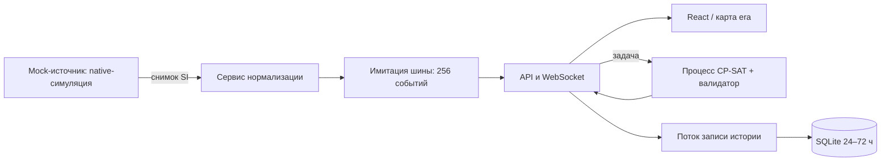

# Общее приложение: frontend + backend + logic

## Запуск

Установка зависимостей и сборка frontend описаны в [README](README.md).

```bash
python scripts/setup_local.py
python scripts/run_local.py
```

`setup_local.py` создаёт `.env` с уникальными паролями и внутренним токеном,
правами 0600 и `DEMO_MODE=false`. Пароли не печатаются и не попадают в Git.
Если `.env` уже существует, дополните его параметрами из `.env.example`;
генератор сохраняет имеющийся файл. Для локального запуска нужны `INGEST_TOKEN`
и пароли `VIEWER_PASSWORD`, `DISPATCHER_PASSWORD`, `ADMIN_PASSWORD`.

- `http://127.0.0.1:8000/` — оболочка;
- `/dispatcher/` — панель React и вход;
- `/network/` — карта era со слоем поездов общего сервера;
- `/map.html` — исходная карта без адаптера;
- `/docs` — Swagger API;
- `http://127.0.0.1:8001/docs` — API отдельного сервиса нормализации.

Симуляция одна, в памяти одного процесса API. Не запускайте несколько Uvicorn workers.
История и настройки остаются на диске. После перезапуска модель начинает новый запуск;
оперативное состояние целиком из истории не восстанавливается.

Без отдельного сервиса можно запустить `uvicorn integration.main:app --env-file .env`
при пустом `INGEST_URL`; это встроенный режим разработки. Для демонстрации архитектуры
используйте `run_local.py` или два сервиса Compose.

## Архитектура



`backend/ingestion/service.py` проверяет позиции, скорости, сигналы, стрелки и расписание,
приводит км/ч к м/с и выдаёт упорядоченные события. Внутренние запросы требуют Bearer-токен.
Повтор `event_id` с тем же содержимым не создаёт дубль; изменённое содержимое отвергается.
`GET /events?after=...` сообщает о пропущенном диапазоне при переполнении буфера.
Это имитация брокера: буфер недолговечный, долговременная история находится в SQLite.

Отправка снимков идёт асинхронно. Очередь из восьми снимков при перегрузке сохраняет
свежие данные; число пропусков и ошибки видны в `/api/logic/performance`. При недоступном
сервисе нормализации поток перестаёт обновляться, и интерфейс показывает устаревание.
Следующий полный снимок восстанавливает поток. HTTP API остаётся доступным.

## Алгоритмы и ограничения

- Начальный план — FCFS с резервированием маршрута.
- CP-SAT рассчитывает баланс, приоритет пассажирских и экономию энергии.
- Проверяются направление и занятость главных путей, длина станционных путей,
  ограничения скорости, закрытия, сигналы, стоянки и физическое время хода.
- Одна **условная общая горловина** на станцию: прибытие и отправление резервируют
  её на 15 секунд. Терминальные операции вне линии её не занимают. Пересечения
  интервалов запрещены в baseline, CP-SAT и независимом валидаторе. Это консервативная
  синтетическая топология, не реальные номера и взаимозависимости стрелок.
- Уже начатые движения и занятые пути не переносятся при перепланировании.
- При сбое часы симуляции удерживаются до выбора допустимого плана. Старый прогноз
  помечается недействительным и скрывается; применяемый вариант проверяется повторно.
- На расчёт альтернатив отведено 3,2 с; оставлен резерв для профилей и передачи ответа
  в общей цели 5 с. Превышение отражается в `within_budget`, жёсткой гарантии реального
  времени для любого компьютера нет.

Профиль скорости учитывает массу, сопротивление, уклон, скорость и ускорение/торможение.
Расход тяги интегрируется по расстоянию, вспомогательного питания — по времени,
включая все ожидания. Исходный `vendor/railsim` сохранён.

## Индекс

По умолчанию `I = 100 × (0.30P + 0.20T + 0.20E + 0.15C + 0.15A)`:

| Компонент | Определение |
|---|---|
| P | max(0, 1 − средняя задержка с учётом приоритетов / норма задержки) |
| T | Доля запланированных к концу окна поездов, прибывших в пределах окна |
| E | max(0, 1 − энергия / бюджет энергии) |
| C | 1 при отсутствии конфликтов; для недопустимого прогноза — 0 |
| A | Доля прибытий в пределах ± допуска от целевого времени |

В фактическом индексе учитываются только уже достигнутые события. До первого прибытия
A неизвестен: известные веса нормируются на их сумму, индекс помечен предварительным.
Если весь вес отдан неизвестным компонентам, возвращается `null` и «Нет данных».
Прогноз с нарушениями не считается применимым; этот статус отделён от фактического индекса.

Администратор меняет пять весов (сумма 1), нормы, допуск и два порога. Категории по
умолчанию: Норма ≥80, Внимание ≥50, Критично <50. Вторая формула:
`I = 100 × произведение(component ** weight)`; нулевой компонент с положительным весом
даёт нулевой индекс. Неизвестные компоненты исключаются с нормировкой весов.
Произвольный исполняемый код и `eval` не используются.

Настройки сохраняются атомарно в `data/metrics.runtime.json` или `METRIC_CONFIG_PATH`.
`config/metrics.json` содержит исходные значения. Сброс модели сохраняет пользовательскую
формулу; новые варианты нужно пересчитать. Приоритеты поездов задаются отдельно.

## Дополнительный API

Общая авторизация: viewer читает, dispatcher управляет, admin настраивает.

| Метод | Назначение |
|---|---|
| GET /api/logic/diagnostics | Сценарий, план, независимая проверка |
| GET /api/logic/metrics | Факт, прогноз, пять компонентов |
| GET /api/logic/track-load | Загрузка главных и станционных путей |
| GET/PUT /api/logic/metric-config | Чтение / сохранение формулы и порогов |
| GET /api/logic/performance | Частота, задержки отрисовки, состояние нормализации |
| POST /api/incidents/batch | От 1 до 10 сбоев атомарно; один пересчёт |
| GET /api/logic/scenarios | 19 исходных сценариев проблем |
| POST /api/logic/scenarios/{kind} | Новый запуск с выбранным сценарием |
| GET /api/logic/economics/rates-example | Явно учебные ставки |
| POST /api/logic/economics | Сравнение текущих допустимых планов по переданным ставкам |
| POST /api/logic/realism | Отдельный эксперимент railsim, 1–10 прогонов |

Пакет сбоев: `{"incidents":[{"kind":"signal","target_id":"<section-id>","duration_s":600}]}`.
Ошибочный элемент отклоняет весь пакет. Типы: delay, closure, signal, speed_restriction.
Экономика: `{"reference_plan_id":"<id>","rates":{...}}`; результаты не применяются автоматически.
Railsim: `{"runs":1,"seed":42}` — эксперимент над исходным коридором, не изменение живой модели.

## Контейнеры

```bash
python scripts/setup_local.py
docker compose -f docker-compose.yml -f compose.integrated.yml up --build
```

API публикуется только на `127.0.0.1:8000`. Ingestion доступен внутри Compose-сети.
История и настройки сохраняются в `dispatch-data`. Один и тот же образ используется
для двух процессов. В этом окружении Compose-плагин отсутствует; проверка контейнеров
выполняется через `docker build` / `docker run`.

## Проверки и демонстрация

```bash
python -m pytest backend/tests tests integration/tests -q
node --test integration/tests/coordinates.test.mjs
python -m integration.smoke
python -m integration.benchmark
```

Smoke и benchmark читают `.env`, входят диспетчером, изменяют и сбрасывают тестовый запуск.
Для другого адреса задайте `BASE_URL`. Benchmark сохраняет результат в
`output/regulation-benchmark.json`; путь меняется через `BENCHMARK_OUTPUT`.

Чтобы измерить отрисовку, откройте `/dispatcher/` в видимой вкладке и запустите benchmark.
После React commit и двух animation frames страница подтверждает событие через WebSocket.
Сервер измеряет время от создания снимка через нормализацию до подтверждения, включая
обратную доставку. Это оценка завершения кадра, не измерение физического вывода пикселей.
Скрытые вкладки не дают замеров. Отсутствие замеров не означает выполнение лимита 500 мс.

[Таблица регламента](docs/regulation-status.md), [результаты](docs/regulation-benchmark.json),
[презентация](docs/presentation/RailFlow.pptx), [живой показ](docs/demo-script.md).

## История объединения и сохранность источников

Исходные коммиты: `era` 221fb8e, `M_part` ed58c04, `logic` 7db5b1d.
Их история сохранена в `integrated`. `integration/source-manifest.json` хранит неизменные
контрольные суммы 347 исходных файлов. Последующие разрешённые изменения перечислены
в `backend-changes.json`, `frontend-changes.json`, `regulation-changes.json` внутри `integration/`.

Новый патч frontend отдельно согласован пользователем: категории, компоненты и настройки
индекса, состояния путей/горловин, измерение отрисовки. Макет сохраняется.
`integration/regulation-frontend-proposal.patch` — согласованный исходный diff.

Оригинальные `map.html`, `map_data.js`, `network.json` и `vendor/railsim` не изменены.
Тест сравнивает остальные исходники с манифестом с учётом перечисленных исключений.
GitHub Actions ранее не запускался из-за блокировки аккаунта владельца по оплате;
расходы и платные услуги не подключались. Проверки выполняются локально.
