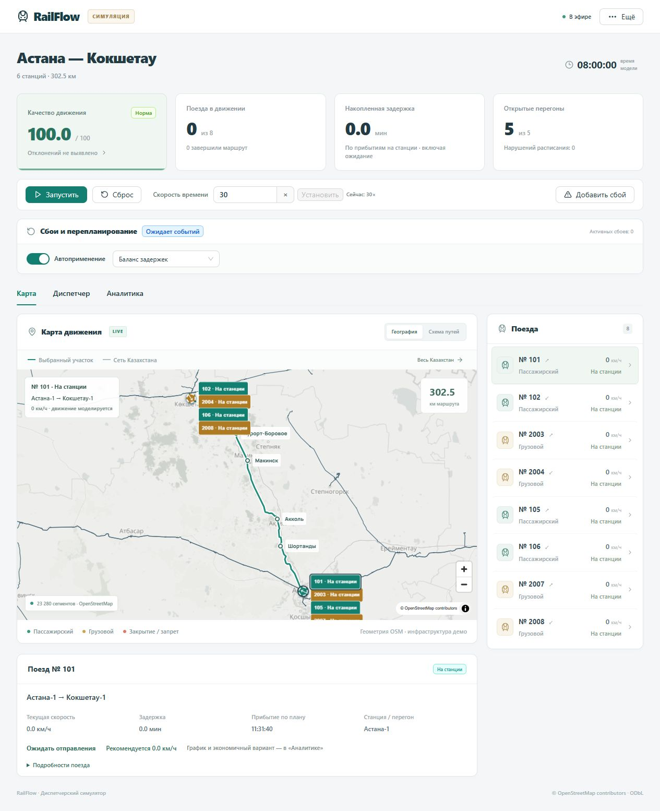

# RailFlow — Astana–Kokshetau dispatcher simulator

A working local web application built around the Kazakhstan GeoJSON. The full
rail network is visible on the map; the simulation is limited to a connected
302.5 km Astana–Kokshetau corridor with six demo station anchors and eight trains.

## Documentation

- [Runbook](docs/runbook.md): installation, ports, configuration, demo steps and troubleshooting.
- [Architecture](docs/architecture.md): component diagram, process boundaries and replanning flow.
- [API guide](docs/api.md): roles, REST examples, WebSocket and archive contracts.
- [Requirements checklist](docs/requirements-checklist.md): coverage against the presentation, evidence and remaining verification.
- [Final local verification](docs/final-verification.md): measured performance, browser walkthrough, regression fix and limitations.
- [Latest technical verification](docs/compliance-verification.md): independent ingestion services, compressed retention and visible paint timing.

Current local demo: **http://127.0.0.1:8001/**. Docker uses port **8000** by default.
All eight feature stages and final local verification are complete. The reports
describe measured limits and deployment qualifications. Presentation work is deferred.

After installing dependencies and building the frontend as described in the
[runbook](docs/runbook.md), start the full service deployment with:

```powershell
.\.venv\Scripts\python.exe scripts/run_local.py
```

This starts the website on 8001 plus movement, infrastructure and timetable
ingestion on 8101–8103. Use `--env-file .env` to load role configuration.
`http://127.0.0.1:8001/api/health` shows readiness and storage statistics.



## Step 1: railway-section map

The full Kazakhstan layer retains 23,280 OSM rail segments. The simulated section
is Astana–Kokshetau: six named station anchors, five connected sections and eight
mock trains. Stations and capacity are demo assumptions; this is not a live feed.

- Click **К маршруту** to focus on the section; **Весь Казахстан** restores the
  nationwide view without removing its rail layer.
- Click **Запустить**: opposing trains move along the actual rail polyline.
  Their circular marker centres stay on the line; arrows follow travel direction.
  Green means passenger, amber means freight. Labels show waiting/moving/arrived.
- Click a train marker or train list entry to select it and see its named route,
  speed and status. Click a station to see its name, route distance and demo capacity.
- Pause to inspect; use **Сброс** to restart after completing the route.
- Rail data loads independently of external map tiles. If the nationwide dataset
  fails to load, use **Повторить** in the map caption.

`backend/app/railway_map.py` provides map infrastructure and train coordinates.
`GET /api/map` returns station Points and railway LineStrings as GeoJSON.
`GET /api/network` returns the unchanged nationwide lines. Existing `/api/state`
and `/ws` snapshots now include train `coordinate` ([longitude, latitude]),
`bearing_deg` (clockwise from north), `route_station_ids`, `route_name`,
`origin_id`, `destination_id`, and `position_source=simulation`.
The browser renders these backend coordinates rather than calculating a second
position independently. Model distance is projected onto each rail polyline.
The map follows the active simulation timetable and incident state described below.

## Step 2: realtime train data

Position, speed, delay, route and infrastructure state arrive over WebSocket,
targeting **2 Hz**. Reconnection loads a full snapshot; the browser rejects older
responses and disables controls when the stream is stale. The source is simulated
Astana–Kokshetau data. See [the realtime guide](docs/realtime.md) for the API,
event contract, clock behavior and recovery checks.

## Step 3: autodispatcher

The **Автодиспетчер** panel shows independently checked conflicts, train priorities,
next pass/wait decisions, and the complete section reservation order. Use
**Пауза и расчёт**, compare a proposed schedule, then apply it and resume.
See [the stage 3 guide](docs/autodispatcher.md) for rules, limitations, API fields,
and checks. Stage 2 live updates and the full Kazakhstan map remain available.

For a separate, isolated stage-3 website, open **/stage3.html** on the same server
(for example http://127.0.0.1:8001/stage3.html). Choose a conflict scenario, change
priorities, calculate a schedule and replay it without altering the main simulation.

## Step 4: automatic replanning

The main dashboard now recalculates after delays, signal failures, section closures
and early incident resolution. **Автоприменение** is enabled by
default; turn it off to review candidates manually. Started movements are preserved,
new departures wait for a validated replacement, and reset discards in-flight results.
The **Сбои и перепланирование** panel shows progress, incident resolution,
and recovery controls. Its comparison shows quality, conflicts and delay before/after,
with signed changes and calculation time. Expand **Все показатели и изменения
расписания** for energy, arrival accuracy, every train's terminal ETA, and changed
departure/arrival/tail-release times. These are forecasts evaluated with the same
conditions; an invalid old schedule is labelled explicitly, even when its delay
looks smaller.

For manual review, turn off **Автоприменение**, add a ten-minute delay to **№101**,
then open **Диспетчер → Сравнить график** on any candidate. The comparison follows
that selected candidate, and the graph overlays it on the currently active timetable.
**Обновить оценку** rechecks its forecast if model time has advanced. Applying a plan
captures the final comparison in history and CSV. See [the stage 4 guide](docs/replanning.md).

## Step 5: speed and energy advice

Select a train on the map for a compact live recommendation. Open **Аналитика →
Скорость и энергия** for current speed, the active recommended speed, a target
10 model seconds ahead, next-station and final arrival estimates, remaining
traction energy, and the speed graph with a current-position marker.
The simulation's time multiplier is separate from train speed in km/h.

To demonstrate energy saving:

1. Reset the scenario and leave it paused. Open **Аналитика** and select **№105**.
2. In **Экономичный ход**, press **Рассчитать**. The initial fixture offers about
   **52.27 kWh / 3.73%** less forecast traction energy over that train's trip.
3. Compare the dashed economy profile and intermediate arrival changes. The
   candidate lengthens one run by 15 minutes, shortening the following station
   wait. All departures and every train's final arrival stay unchanged. Later
   intermediate arrivals are reported separately. In stage 6, slower running can
   lower delivered distance in individual rolling windows, while departure and
   final-arrival accuracy remain unchanged.
4. Press **Применить экономичный план**, then **Запустить**. The simulator follows
   the new profile; advice, map speed, ETA and energy consumption agree. In the
   initial fixture the changed section starts at model time **10:45:40**.
5. Add a closure or signal failure: waiting trains receive a zero-speed hold,
   while already-entered trains retain their committed profile. Future profile
   samples and final ETAs are withheld until a validated replacement is applied.

The active recommendation uses the same forward-acceleration/backward-braking
profile and sampler as simulated movement. Thus current and recommended speed
normally match in this mock feed. The 10-second target anticipates acceleration
or braking; it is not an instantaneous speed change.

Economy planning is an optional, bounded heuristic, not an optimal-control solver.
For each unstarted intermediate leg of the selected train, it tries at most eight
longer durations (up to 900 seconds), capped by the next scheduled departure,
mandatory dwell, the next section reservation and future closures. Every trial
passes the independent full-plan validator: sections, signals, switches, station
capacity, physics and committed movements. Final legs and all departure times
stay fixed. No feasible slack returns an explicit no-change result, e.g. №101
in the baseline. Changing a moving train's committed run is not allowed.

Profiles use a reduced cruise speed with passenger acceleration/braking limits
0.45/0.65 m/s² (freight 0.2/0.4), and each leg starts/ends at zero speed. Energy
is positive traction work divided by efficiency, under the existing level-track,
synthetic-resistance, no-regeneration model. Savings shown before application are
forecasts; actual model consumption follows the applied profile.

- `GET /api/trains/{id}/advice`: live advice plus detailed profile.
- `GET /api/trains/{id}/profile`: detailed active profile; `provisional` and nullable
  energy/ETA indicate an incident hold. Only committed samples are exposed then.
- `POST /api/trains/{id}/eco-plan`: dispatcher/admin, paused valid state; stores a
  candidate and returns its profile, energy comparison and intermediate changes.
- `POST /api/plans/{id}/apply`: existing independently validated application route.
- `/api/state`, `/api/trains`, `/ws` and new history snapshots include each train's
  compact `speed_advice`. Old history without the field remains readable.

Reset, incident changes, movement during calculation or a different active plan
invalidate economy proposals. Calculation uses the existing worker process and
leaves live updates responsive. The browser also checks train, epoch, timetable,
constraint version and calculation time before showing an actionable proposal.

Validation: `python -m pytest backend/tests/test_speed_advice.py -q` and
`python scripts/smoke_speed_advice.py http://127.0.0.1:8001` (the latter resets the
local demo before and after the check).

## Step 6: Movement Quality Index

Open **Аналитика → Качество движения**, or click the headline quality card.
The score now has five independently explained components, their weights and
their lost points. The card names the largest cause of the current reduction.
Missing measurements are labelled **Пока нет данных** and receive a neutral
score instead of claiming that trains have already arrived accurately.

| Component | Default weight | Score from 0 to 100 |
| --- | --- | --- |
| Departure accuracy | 42% | `100 × max(0, 1 − sum(abs(departure − baseline departure)) / delay_norm_s)` |
| Capacity delivery | 20% | `100 × incident-free section fraction × min(1, distance delivered / baseline distance)` |
| Energy efficiency | 18% | `100 × max(0, 1 − max(0, energy − reference energy) / energy_norm_kwh)` |
| Plan validity | 10% | `100 / (1 + conflict_penalty × independently detected plan violations)` |
| Final-arrival accuracy | 10% | Percentage of assessed terminal arrivals within the configured ± tolerance |

This is an explicit demo formula, not an industry-standard railway KPI.
Version 4 supports runtime configuration under **⋯ → Настройки сценария**:

- All five relative weights are editable from 0 to 1000 and normalized to 100%.
  A zero weight excludes that component; at least one must be positive.
- **Взвешенное среднее** (default): `Q = sum(weight × component score)`.
- **Геометрическое среднее**: `Q = 100 × product((score / 100) ** weight)`.
  Here `weight` means the normalized fraction. A zero score with a positive
  weight makes the geometric index zero. Disabled components are ignored.
- Configurable categories: **Норма** when `Q ≥ normal`, **Внимание** when
  `attention ≤ Q < normal`, and **Критично** when `Q < attention`.
  Defaults are 90 and 70; validation requires `0 ≤ attention < normal ≤ 100`.
  Classification uses the displayed score rounded to one decimal.
- Departure/energy normalization, arrival tolerance, and the per-violation
  penalty are editable. Passenger/freight dispatcher priorities remain available
  separately; quality weights change evaluation, not the scheduling objective.

Only administrators can save settings (demo mode has admin access). Changes
apply immediately to live scores, forecasts and WebSocket updates without a
rebuild or restart. They invalidate previously calculated candidate plans.
Settings apply to the current run; resetting the scenario restores defaults.
The backend rejects invalid/nonfinite values and invalid threshold ordering.
Legacy API clients can still send `delay_weight` / `energy_weight` to divide the
original 60% share when `quality_weights` is omitted. Explicit five-component
weights take precedence when supplied.

In the geometric breakdown, lost points are allocated by each component's
logarithmic contribution. If positive-weight zero scores exist, they share all
100 lost points in proportion to their weights. Both breakdowns reconcile to
the total, allowing for display rounding.

The total is bounded to 0–100. Early departures count as
deviations, not as negative delay. Unfinished overdue departures accrue deviation;
an unfinished terminal arrival counts as late once its tolerance has elapsed.
The separate accumulated-delay card still includes intermediate station arrivals.

**Capacity usage** now measures each section's occupied seconds (entry through
tail release), occupancy percentage and delivered train-kilometres. Live values
use the last 900 model seconds, clipped at the beginning of the run. Interval
unions avoid double-counting overlapping reservations or incidents. Occupancy and
entry restrictions may overlap when an already-entered train clears a closure.
The score compares actual progress with the original timetable over the same
window; high occupancy alone is not rewarded. When no movement is expected,
delivery is neutral. Closure/signal availability still affects the score instantly.
This is an operational-use proxy, not a theoretical maximum-throughput calculation.

**Energy** compares the traction model with baseline energy at the same distance.
Saved kWh and percentage are explicit, and excess energy reduces the score.
Savings do not increase an already-perfect score above 100. **Conflicts** are
split into resource conflicts, incident restrictions and other validation errors;
they describe the timetable, not reported physical collisions.

The analytics panel separates current results from the whole-scenario forecast.
Forecast capacity uses a common horizon: the end of the original timetable, so
extending a proposed plan cannot change its comparison denominator. Invalid or
held active plans have no published quality forecast. These different evaluation
periods are labelled; their index difference is not presented as measured benefit.

The last-15-minute chart uses saved snapshots from the current reset epoch and
the current formula/weights only. Downsampling retains local extrema. Paused
incident changes can share a model timestamp and remain visible as distinct
observations. It does not invent measurements between large accelerated steps.
Old archive snapshots remain labelled with their original formula version.

`GET /api/quality` is read-only and available to viewers. It returns current
metrics, a valid active-plan forecast or `null`, and a compact trend. `/api/state`,
WebSocket updates, plan comparisons and stored snapshots carry `quality_version: 4`,
component scores/losses, departure/final-arrival counts, capacity details, energy
savings, conflict categories and a formula signature. Reset clears the chart's
visible epoch, while changing scoring settings separates incompatible formulas.
The saved formula includes aggregation, normalized weights, penalty and thresholds.
Archived scores/categories are not recalculated when live settings change.

To check: reset and leave paused, then close the default **section-1** for ten
minutes. Quality changes **100 → 96**, the capacity component becomes **80**, and
its weighted loss is **4 points**. Resolve it before advancing time: **96 → 100**.
Run at 30× to see occupancy and delivered distance update; use an incident to
observe holds, departure deviations and capacity shortfalls. Economy mode on
№105 remains available, with about 52.27 kWh forecast saving in the baseline.

To check runtime configuration while that closure is active and paused, set
capacity weight to 100 and every other weight to 0: the index becomes **80**.
Set normal to 85 and attention to 75: the label is **Внимание**. Set attention
to 85 and normal to 95: the same score is **Критично**. With schedule/capacity
weights 50/50, the weighted index is **90** and the geometric index is **89.4**.
Reset afterward to restore the original configuration.

Checks: `python -m pytest backend/tests/test_quality.py backend/tests/test_quality_settings.py -q`,
`python scripts/smoke_quality.py http://127.0.0.1:8001`, and
`python scripts/smoke_quality_settings.py http://127.0.0.1:8001`
(smoke scripts reset the demo before/after; run them sequentially).

## Steps 7–8: history playback and report export

Open **История** in the header. Choose a saved run and the last **5, 10 or
15 minutes of model time**, then use the timeline, previous/next buttons or
**Воспроизвести**. Close the drawer to watch the map with the archive player at
the bottom. Playback advances through saved frames at 1, 2 or 4 frames/second.
Click an incident or plan event to jump to its first recorded resulting state.
**В эфир** returns to current WebSocket data and restores simulation controls.

The archive shows recorded positions, speeds, delays, incidents, timetable and
quality at each selected moment. It never rewinds the server or applies old plans.
The live simulation continues independently if it was running. Multiple changes
while paused remain separate frames even when they have the same model time.
Large time multipliers produce gaps between samples; playback does not invent
intermediate measurements. Loading fetches a compact timeline, then individual
frames, with a bounded browser cache.

SQLite preserves old runs across resets and server restarts. The selector lists
the latest 20 retained runs. Retention defaults to **48 real hours**, configurable
from 24 to 72 via `RETENTION_HOURS`. The live simulation itself starts a fresh
run after a server restart. **Обновить** loads the latest saved window; an opened
window stays fixed so moving live time cannot silently change its report.

**Скачать отчёт CSV** exports that exact run/window, including:

| `record_type` | Contents |
| --- | --- |
| `summary` | Window, snapshot/event counts, applied-plan count and sampling notes |
| `quality`, `component`, `formula` | Recorded index/category, delay/energy totals, five scores, weights, thresholds and formula identity |
| `train` | Each saved train's delay, speed, position, energy and status |
| `conflict` | Each observed timetable violation and its resources/trains |
| `event` | Incidents, resolution, simulation controls and replanning lifecycle |
| `replan` | Quality, delays, energy and violations before/after each applied plan |
| `replan_train`, `replan_movement` | Terminal arrival, departure, intermediate arrival and tail-release changes |

This is a single, filterable long-form CSV: `metric`, `value`, `unit` hold
observations; `before`, `after`, `change` hold comparisons. `basis=actual` means
a recorded model result; `forecast_at_application` is a timetable forecast, not
a measured improvement. Violations describe schedule validation, not physical
collisions; repeated conflict rows are observations, not unique incidents.
Delay and energy values must not be summed across successive snapshots.
Formula identities are retained when settings change. UTF-8 with BOM preserves
Cyrillic in Excel; text cells that resemble spreadsheet formulas are escaped.

To demonstrate the complete flow:

1. Reset while paused, close **section-0** for 10 minutes and wait for automatic
   application. Inspect the quality change and the before/after schedule.
2. Start at **30×** for roughly 10–20 seconds, then pause.
3. Open **История** in the header, choose **15 minutes**, and click the incident
   and applied-plan events. Close the drawer and replay the map.
4. Download CSV and filter `record_type` to `replan` to inspect the comparison,
   or `train` / `quality` for recorded results. Return to live mode afterward.
5. Reset and choose the previous run in history: its snapshots and report remain
   available until retention expiry.

Read-only APIs (viewer access required outside demo mode):

- `GET /api/history/runs`: retained runs and current run ID.
- `GET /api/history/window?epoch=...&minutes=15`: compact frames/events and fixed
  `through_id`; optional `to` selects a model-time endpoint.
- `GET /api/history/snapshots/{record_id}?epoch=...`: a saved full snapshot.
- `GET /api/reports/history.csv?epoch=...&minutes=15&to=...&through_id=...`:
  streaming report using the values returned by the window API.
- Existing `/api/history` and the simple current-train `/api/report.csv` remain
  available for compatibility.

Checks: `python -m pytest backend/tests/test_history_reports.py -q`,
`node --experimental-strip-types --test frontend/tests/history.test.mjs`, and
`python scripts/smoke_history_reports.py http://127.0.0.1:8001` (resets the local
demo before/after and verifies a closure, replanning, export and reset recovery).

## Repository layout

```text
backend/       FastAPI, simulator, planning, validation and backend tests
frontend/      React dashboard, map, charts and pinned pnpm dependencies
parser/        OpenStreetMap railway importer
tests/         Importer tests
data/          Versioned GeoJSON; ignored raw downloads and runtime database
scenarios/     Demo topology and reproducible initial timetable
scripts/       Data preparation and local end-to-end smoke check
docs/          Architecture, runbook, API, requirements checklist and feature guides
.github/       CI workflow and pull request template
```

The source, lockfiles, scenario fixtures and application GeoJSON are versioned.
Virtual environments, `node_modules`, compiled frontend output, `.env` files,
raw downloads and the SQLite database stay local.

## Run the website

With Docker installed:

```powershell
docker compose up --build
```

Open **http://127.0.0.1:8000**. API documentation: **http://127.0.0.1:8000/docs**.
The container serves the compiled React frontend and FastAPI from one origin;
SQLite is kept in the named `dispatch-data` volume. Docker is optional.

For local development (Python 3.12, Node 22.18+ or Node 24, pnpm 11.25.0):

```powershell
python -m venv .venv
.\.venv\Scripts\python.exe -m pip install -r backend/requirements.lock.txt
pnpm --dir frontend install --frozen-lockfile
pnpm --dir frontend build
.\.venv\Scripts\python.exe -m uvicorn backend.app.main:app --host 127.0.0.1 --port 8000
```

Run these commands from the project root after cloning. Install pnpm 11.25.0
(the version pinned in `frontend/package.json`). Use one Uvicorn worker: the
simulator owns the shared state. After the first build, only the final command
is needed to restart the application.

On Linux/macOS replace `.\.venv\Scripts\python.exe` with `.venv/bin/python`.

For the current local address use `--port 8001`. Build before starting the backend;
it registers static frontend routes at startup. The [runbook](docs/runbook.md)
covers pnpm installation, environment loading, development proxy and troubleshooting.
Docker startup is documented but was not tested in the current environment.
The prepared GeoJSON and scenario files are included; a new download is not
required to start the demo.

For frontend hot reload, run `pnpm --dir frontend dev` in a second terminal;
Vite proxies `/api` and `/ws` to port 8000. Production frontend changes require
a fresh build. If the server was started before the first build, restart it.

## Try the demo

1. Click **Запустить**. Two opposing passenger trains depart immediately;
   remaining trains follow the frozen initial timetable. Default acceleration
   is 30×. Enter a custom whole-number multiplier and click **Установить**;
   scheduled events retain whole-second timing, and large jumps are processed directly.
2. Select a train on the map, schematic, list or timetable. Compare its speed,
   position, arrival time and calculated traction energy.
3. Click **Добавить сбой**: close a section, fail a protecting signal, or hold a
   train currently at a station. Duration is configurable. Already-entered
   trains clear the section; all new departures are held pending a valid plan.
4. Planning runs in a separate process while state continues streaming. By default,
   incidents trigger automatic calculation, current-state validation and application.
   Turn off **Автоприменение проверенного плана** to compare variants and click
   **Применить** manually. Explicit **Рассчитать варианты** remains a manual preview.
   If no current valid plan is found, departures remain held and the UI offers retry.
5. Open **История** in the header and replay the last 5–15 simulation minutes.
   This is a read-only view; return to live mode to control the simulation.
6. Download the window's CSV report, including incidents and applied replanning
   comparisons. Reset creates a new run; previous runs remain in the selector
   until retention cleanup.

## Implementation and model boundaries

- React, TypeScript, Vite, Ant Design, Zustand, ECharts and MapLibre.
- Python/FastAPI/Pydantic, WebSocket state updates targeting 2 Hz (500 ms) with
  monotonic scheduling and unchanged simulation multipliers, SQLAlchemy
  and SQLite. Events, snapshots and proposed plans are stored for 48 hours by
  default (`RETENTION_HOURS`, clamped to 24–72).
- OR-Tools CP-SAT variants share a five-second calculation budget, including
  independent checking. Actual elapsed time and whether the budget was met are
  returned, rather than treating a feasible result as proven optimal. A validated
  priority-order heuristic is the fallback; failure is explicit.
- Independent validation checks section conflicts, tail release, station
  capacity, shared station switch routes, closures, signals, dwell, physically
  reachable running times and immutability of committed movement.
- Speed profiles use forward acceleration and backward braking constraints,
  with a lower cruise-speed search for a requested longer window. Scheduling
  normally uses the minimum feasible duration. Stage 5 can replace unstarted
  intermediate runs with independently validated slower profiles using spare
  dwell time; the simulator then follows the applied economy profile.
- All calculations use metres, seconds, m/s and kilograms. UI converts units.
  Live delay includes completed station arrivals and unfinished overdue arrivals;
  future predicted delay remains separate in plan forecasts. The live quality
  index responds immediately to closures/signals, including while paused.
  The version-4 quality formula and evaluation windows are documented in Step 6
  above. Departure deviations, capacity delivery, energy excess, plan violations
  and terminal arrival accuracy have separate scores. Baseline energy consumption
  does not lower the score; unavailable measurements are explicitly neutral.
  Reopening a section restores availability, but does not erase incurred delay.
  Snapshots carry `quality_version: 4` and the component scores/weights/losses.
  Click **Качество движения** to inspect the breakdown. After reset, closing
  **section-1** for 10 minutes while paused gives **100 → 96** (one of five
  sections blocked); resolving it gives **96 → 100** if no delay has accrued.
- The map fills the screen; floating panels sit on top of it. The header switches
  between **Карта**, **Диспетчер**, **Аналитика** and **История** (archive and CSV).
  The left column shows the quality index, section KPIs and replanning status; the
  right column lists trains with search and status filters, and selecting a train
  opens its card with route progress. The bottom bar starts/pauses, resets, sets the
  time multiplier and adds incidents. The bottom-right dock switches **География** /
  **Схема путей**, toggles **Весь Казахстан** and shows the legend. Scenario settings
  and the stage-3 demo are under **⋯**. Manual plan review/application is on
  **Диспетчер**; charts and detailed quality metrics are on **Аналитика**. Escape
  closes the open panel.
- The sun/moon button in the header switches light and dark themes; **⋯ → Тема →
  Как в системе** follows the OS setting. The choice is stored per browser. Dark mode
  shows the same map through a night filter on the map canvas; markers are unchanged.
  Panels use a liquid-glass material; in Chromium the header and bottom bars also
  refract what is behind them.
- **3D-вид** in the map dock draws the same live trains on the real corridor geometry:
  TE33A-style diesels (freight trains double-headed), coal gondolas and boxcars sized from
  each train's simulated length, passenger coaches, stations with passing loops, ballast,
  sleepers and overhead line. Two fixed cameras follow the selected train: **2D сверху**
  (north-up plan) and **3D** (three-quarter view ahead of the locomotive); the mouse wheel
  only zooms. Click a train label to select it. Models are approximate, not engineering data.
- Geometry is real OSM linework; the operating model is synthetic: single-track
  sections, 90 km/h limit (72 for freight), 90-second intermediate dwell, two
  intermediate station tracks, eight terminal tracks. Station anchor coordinates
  are approximate and snapped to the connected path. Actual station boundaries,
  interlockings and operating rules have not been imported.
- Switches represent one shared station throat, reserved for 15 seconds per
  arrival/departure. Tail release is conservatively `train length / 5 m/s + 15 s`.
  The traction model assumes level track, simple resistance, fixed efficiency
  and no regeneration. This is a demo, not operational train-control software.
- Background map tiles and the optional web font need internet access. Railway
  geometry, the schematic, simulation and data storage run locally. The original
  all-country GeoJSON is fetched once by the browser, not on each state update.
- History exposes saved 5–15-minute windows from the latest 20 retained runs.
  CSV includes observations and events in the selected window; replanning
  comparisons are forecasts recorded when a replacement plan was applied.

## Access and configuration

Default **DEMO_MODE=true** intentionally gives the local demo administrator
controls and displays a demo badge. The server/Compose port is bound to localhost.
For role-based access copy `.env.example` to `.env`, set `DEMO_MODE=false`, and
provide separate `VIEWER_PASSWORD`, `DISPATCHER_PASSWORD`, `ADMIN_PASSWORD` values.
For local Uvicorn, add `--env-file .env`; Compose reads `.env` automatically.
Viewer can inspect/export; dispatcher can control movement and plans; only admin
can change weights. Sessions are HttpOnly cookies, expire after eight hours and
are cleared on server restart. Use `COOKIE_SECURE=true` behind HTTPS. No public
deployment or production account-management system is included.

## Tests and reproducibility

```powershell
.\.venv\Scripts\python.exe -m pytest backend/tests tests -q
pnpm --dir frontend test
pnpm --dir frontend build
```

Tests cover physics, station/section/switch conflicts, three incident types,
the ten-incident scenario, stale-plan rejection, role enforcement, history
read-only behavior, deterministic stepping and the existing importer.

`scenarios/baseline-plan.json` freezes the validated initial timetable so reset
does not depend on solver runtime. To intentionally rebuild scenario artifacts:

```powershell
.\.venv\Scripts\python.exe railway_parser.py --input data/overpass.json
.\.venv\Scripts\python.exe scripts/build_corridor.py
.\.venv\Scripts\python.exe scripts/freeze_baseline.py
```

The first command above requires a local raw download. On a fresh clone, either
use the included GeoJSON unchanged or download raw data first with
`python railway_parser.py --save-raw data/overpass.json`.

Backend modules are in `backend/app/`: `domain`, `advisory`, `planning`,
`validation`, `metrics`, `simulator`, `storage`, and `main` (API/event integration).
`frontend/src/` holds the dashboard, map/schematic, charts and realtime store.

## GitHub workflow

GitHub Actions is configured to run Python tests, frontend state/contract tests,
and the TypeScript/production build on pushes to `main` and on pull requests.
It installs from committed lockfiles and can also be started manually. Local
test success does not establish that a remote Actions run has completed.

This working copy uses branch **M_part** and already has `origin` configured for
`g1gantera/hackathon-alt-university`. These documentation updates do not commit,
push or merge the working changes. Before sharing a revision, inspect `git status`,
review the diff and staged files, run the checks above, then commit and push the
intended branch. A feature-branch push alone does not trigger this workflow;
open a pull request or run it manually. Do not initialize a new repository or
replace the existing remote as part of normal startup.

Runtime databases, raw downloads, dependencies, build output and real `.env`
files are ignored. Only tracked/committed files reach another clone; uncommitted
features must be included in the reviewed source revision before submission.

OpenStreetMap data attribution and license are documented in
[data/README.md](data/README.md). No source-code license has been selected yet;
choose one before presenting the code as an open-source release.

## Kazakhstan railway parser

Exports railway line geometry to GeoJSON, excluding stations, platforms, stops,
signals, crossings and other point/area features. Python 3.10+; no dependencies.

[RailsMaps](https://railsmaps.com/kazakhstan) identifies OpenStreetMap as its data
source. This importer queries that underlying dataset using the
[Overpass API](https://wiki.openstreetmap.org/wiki/Overpass_API/Overpass_QL),
not RailsMaps HTML or rendered tiles. It does not reproduce RailsMaps styling,
filters or its exact cached snapshot.

```powershell
.\.venv\Scripts\python.exe railway_parser.py
```

Output: `data/kazakhstan_railways.geojson`. Import it into QGIS, Leaflet,
MapLibre or your backend. GeoJSON coordinates are `[longitude, latitude]` in
WGS84. All original way tags are preserved, including name, operator, gauge,
electrified, voltage, maxspeed, usage and service when mapped. Missing tags
are not inferred. OSM node IDs are retained in `osm_nodes` for future topology
work; no station objects or station node tags are exported. Tracks passing
through stations are retained.

```powershell
# Conventional railway tracks only (including yards, sidings and spurs)
.\.venv\Scripts\python.exe railway_parser.py --rail-only

# Include construction, proposed and historical railway ways
.\.venv\Scripts\python.exe railway_parser.py --include-inactive

# Save source data and later convert it offline
.\.venv\Scripts\python.exe railway_parser.py --save-raw data/overpass.json
.\.venv\Scripts\python.exe railway_parser.py --input data/overpass.json --output data/offline.geojson

# Inspect the query or use another Overpass server
.\.venv\Scripts\python.exe railway_parser.py --print-query
.\.venv\Scripts\python.exe railway_parser.py --endpoint https://overpass.kumi.systems/api/interpreter

# Offline checks
.\.venv\Scripts\python.exe -m unittest discover -s tests
```

By default, active rail, light rail, subway, tram, narrow gauge, monorail and
funicular ways are included. `--include-inactive` includes ways whose `railway`
tag has an inactive value; lifecycle-prefix-only tags are not queried.
The Kazakhstan administrative area is used, not a rectangular bounding box.
Ways selected by Overpass retain their full geometry, so border-crossing ways
can extend outside Kazakhstan; this is not an exact border-clipped dataset.
Individual ways are segments, not merged routes or a finished routing graph.

The public API may be busy; failed/partial responses exit with an error without
replacing the existing GeoJSON. Reuse a saved download instead of repeatedly
querying the server. The offline converter filters features but does not verify
their country; supply a Kazakhstan query response.

Data attribution: © OpenStreetMap contributors, under the
[Open Database License](https://www.openstreetmap.org/copyright). Preserve the
attribution when displaying or redistributing the data.
