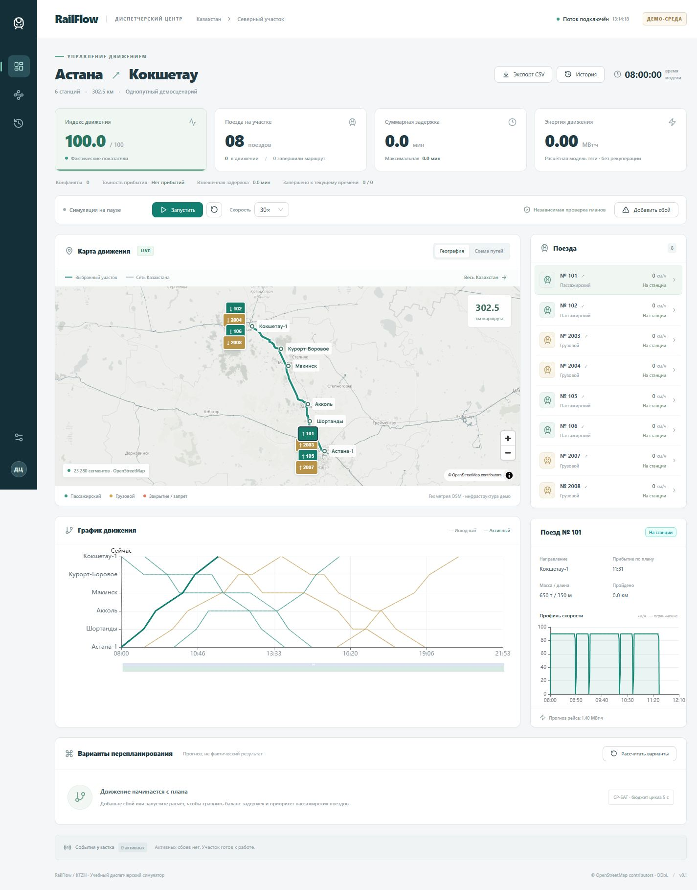

# RailFlow — Astana–Kokshetau dispatcher simulator

A working local web application built around the Kazakhstan GeoJSON. The full
rail network is visible on the map; the simulation is limited to a connected
302.5 km Astana–Kokshetau corridor with six demo station anchors and eight trains.



## Step 1: railway-section map

The full Kazakhstan layer retains 23,280 OSM rail segments. The simulated section
is Astana?Kokshetau: six named station anchors, five connected sections and eight
mock trains. Stations and capacity are demo assumptions; this is not a live feed.

- Click **К маршруту** to focus on the section; **Весь Казахстан** restores the
  nationwide view without removing its rail layer.
- Click **Запустить**: opposing trains move along the actual rail polyline.
  Their circular marker centres stay on the line; arrows follow travel direction.
  Green means passenger, amber means freight. Labels show waiting/moving/arrived.
- Click a train marker or train list entry to select it and see its named route,
  speed and status. Click a station to see its name, route distance and demo capacity.
- Pause to inspect; use **↻ → Сбросить** to restart after completing the route.
- Rail data loads independently of external map tiles. If the nationwide dataset
  fails to load, use **Повторить** in the map caption.

`backend/app/railway_map.py` is the map foundation for the next backend steps.
`GET /api/map` returns station Points and railway LineStrings as GeoJSON.
`GET /api/network` returns the unchanged nationwide lines. Existing `/api/state`
and `/ws` snapshots now include train `coordinate` ([longitude, latitude]),
`bearing_deg` (clockwise from north), `route_station_ids`, `route_name`,
`origin_id`, `destination_id`, and `position_source=simulation`.
The browser renders these backend coordinates rather than calculating a second
position independently. Model distance is projected onto each rail polyline.
This increment focuses on map presentation; later backend steps can replace the
existing simulator behind this contract.

## Repository layout

```text
backend/       FastAPI, simulator, planning, validation and backend tests
frontend/      React dashboard, map, charts and pinned pnpm dependencies
parser/        OpenStreetMap railway importer
tests/         Importer tests
data/          Versioned GeoJSON; ignored raw downloads and runtime database
scenarios/     Demo topology and reproducible initial timetable
scripts/       Data preparation and local end-to-end smoke check
docs/          Preview and recorded local smoke-test result
.github/       CI workflow and pull request template
```

The source, lockfiles, scenario fixtures and application GeoJSON are versioned.
Virtual environments, `node_modules`, compiled frontend output, `.env` files,
raw downloads and the SQLite database stay local.

## Run the website

With Docker installed:

```powershell
docker compose up --build
```

Open **http://127.0.0.1:8000**. API documentation: **http://127.0.0.1:8000/docs**.
The container serves the compiled React frontend and FastAPI from one origin;
SQLite is kept in the named `dispatch-data` volume. Docker is optional.

For local development (Python 3.12, Node 22+, pnpm):

```powershell
python -m venv .venv
.\.venv\Scripts\python.exe -m pip install -r backend/requirements.lock.txt
pnpm --dir frontend install --frozen-lockfile
pnpm --dir frontend build
.\.venv\Scripts\python.exe -m uvicorn backend.app.main:app --host 127.0.0.1 --port 8000
```

Run these commands from the project root after cloning. Install pnpm 11.25.0
(the version pinned in `frontend/package.json`). Use one Uvicorn worker: the
simulator owns the shared state. After the first build, only the final command
is needed to restart the application.

On Linux/macOS replace `.\.venv\Scripts\python.exe` with `.venv/bin/python`.
The prepared GeoJSON and scenario files are included; a new download is not
required to start the demo.

For frontend hot reload, run `pnpm --dir frontend dev` in a second terminal;
Vite proxies `/api` and `/ws` to port 8000. Production frontend changes require
a fresh build. If the server was started before the first build, restart it.

## Try the demo

1. Click **Запустить**. Two opposing passenger trains depart immediately;
   remaining trains follow the frozen initial timetable. Default acceleration
   is 30×, with a fixed simulation step of one second.
2. Select a train on the map, schematic, list or timetable. Compare its speed,
   position, arrival time and calculated traction energy.
3. Click **Добавить сбой**: close a section, fail a protecting signal, or hold a
   train currently at a station. Duration is configurable. Already-entered
   trains clear the section; all new departures are held pending a valid plan.
4. Planning runs in a separate process while state continues streaming. Compare
   the delay-balanced and passenger-priority variants, preview their timetable,
   then click **Применить**. The server revalidates the plan at application time.
   If too much simulation time has passed, recalculate or pause before planning.
5. Open **История** and move the slider through the last 15 simulation minutes.
   This is a read-only view; return to live mode to control the simulation.
6. Export the current factual train snapshot as CSV, or reset to the identical
   initial schedule. Reset starts a new history epoch and preserves old database
   records until retention cleanup.

## Implementation and model boundaries

- React, TypeScript, Vite, Ant Design, Zustand, ECharts and MapLibre.
- Python/FastAPI/Pydantic, WebSocket state updates at 1 Hz wall time, SQLAlchemy
  and SQLite. Events, snapshots and proposed plans are stored for 48 hours by
  default (`RETENTION_HOURS`, clamped to 24–72).
- OR-Tools CP-SAT variants share a five-second calculation budget, including
  independent checking. Actual elapsed time and whether the budget was met are
  returned, rather than treating a feasible result as proven optimal. A validated
  priority-order heuristic is the fallback; failure is explicit.
- Independent validation checks section conflicts, tail release, station
  capacity, shared station switch routes, closures, signals, dwell, physically
  reachable running times and immutability of committed movement.
- Speed profiles use forward acceleration and backward braking constraints,
  with a lower cruise-speed search for a requested longer window. Scheduling
  currently uses the minimum feasible duration, and the simulator follows the
  same profile. There is no third energy-optimizing schedule variant yet.
- All calculations use metres, seconds, m/s and kilograms. UI converts units.
  Actual completed-arrival metrics and energy-to-date are separate from plan
  forecasts. The composite index uses fixed configurable normalization values.
- Geometry is real OSM linework; the operating model is synthetic: single-track
  sections, 90 km/h limit (72 for freight), 90-second intermediate dwell, two
  intermediate station tracks, eight terminal tracks. Station anchor coordinates
  are approximate and snapped to the connected path. Actual station boundaries,
  interlockings and operating rules have not been imported.
- Switches represent one shared station throat, reserved for 15 seconds per
  arrival/departure. Tail release is conservatively `train length / 5 m/s + 15 s`.
  The traction model assumes level track, simple resistance, fixed efficiency
  and no regeneration. This is a demo, not operational train-control software.
- Background map tiles and the optional web font need internet access. Railway
  geometry, the schematic, simulation and data storage run locally. The original
  all-country GeoJSON is fetched once by the browser, not on each state update.
- History currently exposes the active run's last 15 simulation minutes. Older
  runs remain stored, but there is no cross-run history browser. CSV contains the
  current factual train snapshot, not the entire event archive.

## Access and configuration

Default **DEMO_MODE=true** intentionally gives the local demo administrator
controls and displays a demo badge. The server/Compose port is bound to localhost.
For role-based access copy `.env.example` to `.env`, set `DEMO_MODE=false`, and
provide separate `VIEWER_PASSWORD`, `DISPATCHER_PASSWORD`, `ADMIN_PASSWORD` values.
For local Uvicorn, add `--env-file .env`; Compose reads `.env` automatically.
Viewer can inspect/export; dispatcher can control movement and plans; only admin
can change weights. Sessions are HttpOnly cookies, expire after eight hours and
are cleared on server restart. Use `COOKIE_SECURE=true` behind HTTPS. No public
deployment or production account-management system is included.

## Tests and reproducibility

```powershell
.\.venv\Scripts\python.exe -m pytest backend/tests tests -q
pnpm --dir frontend build
```

Tests cover physics, station/section/switch conflicts, three incident types,
the ten-incident scenario, stale-plan rejection, role enforcement, history
read-only behavior, deterministic stepping and the existing importer.

`scenarios/baseline-plan.json` freezes the validated initial timetable so reset
does not depend on solver runtime. To intentionally rebuild scenario artifacts:

```powershell
.\.venv\Scripts\python.exe railway_parser.py --input data/overpass.json
.\.venv\Scripts\python.exe scripts/build_corridor.py
.\.venv\Scripts\python.exe scripts/freeze_baseline.py
```

The first command above requires a local raw download. On a fresh clone, either
use the included GeoJSON unchanged or download raw data first with
`python railway_parser.py --save-raw data/overpass.json`.

Backend modules are in `backend/app/`: `domain`, `advisory`, `planning`,
`validation`, `metrics`, `simulator`, `storage`, and `main` (API/event integration).
`frontend/src/` holds the dashboard, map/schematic, charts and realtime store.

## GitHub workflow

GitHub Actions runs the Python tests and a TypeScript/production build on pushes
to `main` and pull requests. It installs from the committed lockfiles. The
workflow can also be started manually in the repository's Actions tab.

For an initial push to an **empty** GitHub repository, replace `YOUR_NAME` and
`YOUR_REPOSITORY` below with its owner and name:

```sh
git add .
git diff --cached --stat
git commit -m "Initial RailFlow dispatcher simulator"
git remote add origin https://github.com/YOUR_NAME/YOUR_REPOSITORY.git
git push -u origin main
```

The local repository is initialized on `main`. Configure your Git author name
and email if Git asks for them. Create the remote without an initial README or
license so the histories start together; do not force-push over an existing
repository. No remote URL or GitHub credentials are stored in this project.

OpenStreetMap data attribution and license are documented in
[data/README.md](data/README.md). No source-code license has been selected yet;
choose one before presenting the code as an open-source release.

## Kazakhstan railway parser

Exports railway line geometry to GeoJSON, excluding stations, platforms, stops,
signals, crossings and other point/area features. Python 3.10+; no dependencies.

[RailsMaps](https://railsmaps.com/kazakhstan) identifies OpenStreetMap as its data
source. This importer queries that underlying dataset using the
[Overpass API](https://wiki.openstreetmap.org/wiki/Overpass_API/Overpass_QL),
not RailsMaps HTML or rendered tiles. It does not reproduce RailsMaps styling,
filters or its exact cached snapshot.

```powershell
.\.venv\Scripts\python.exe railway_parser.py
```

Output: `data/kazakhstan_railways.geojson`. Import it into QGIS, Leaflet,
MapLibre or your backend. GeoJSON coordinates are `[longitude, latitude]` in
WGS84. All original way tags are preserved, including name, operator, gauge,
electrified, voltage, maxspeed, usage and service when mapped. Missing tags
are not inferred. OSM node IDs are retained in `osm_nodes` for future topology
work; no station objects or station node tags are exported. Tracks passing
through stations are retained.

```powershell
# Conventional railway tracks only (including yards, sidings and spurs)
.\.venv\Scripts\python.exe railway_parser.py --rail-only

# Include construction, proposed and historical railway ways
.\.venv\Scripts\python.exe railway_parser.py --include-inactive

# Save source data and later convert it offline
.\.venv\Scripts\python.exe railway_parser.py --save-raw data/overpass.json
.\.venv\Scripts\python.exe railway_parser.py --input data/overpass.json --output data/offline.geojson

# Inspect the query or use another Overpass server
.\.venv\Scripts\python.exe railway_parser.py --print-query
.\.venv\Scripts\python.exe railway_parser.py --endpoint https://overpass.kumi.systems/api/interpreter

# Offline checks
.\.venv\Scripts\python.exe -m unittest discover -s tests
```

By default, active rail, light rail, subway, tram, narrow gauge, monorail and
funicular ways are included. `--include-inactive` includes ways whose `railway`
tag has an inactive value; lifecycle-prefix-only tags are not queried.
The Kazakhstan administrative area is used, not a rectangular bounding box.
Ways selected by Overpass retain their full geometry, so border-crossing ways
can extend outside Kazakhstan; this is not an exact border-clipped dataset.
Individual ways are segments, not merged routes or a finished routing graph.

The public API may be busy; failed/partial responses exit with an error without
replacing the existing GeoJSON. Reuse a saved download instead of repeatedly
querying the server. The offline converter filters features but does not verify
their country; supply a Kazakhstan query response.

Data attribution: © OpenStreetMap contributors, under the
[Open Database License](https://www.openstreetmap.org/copyright). Preserve the
attribution when displaying or redistributing the data.
