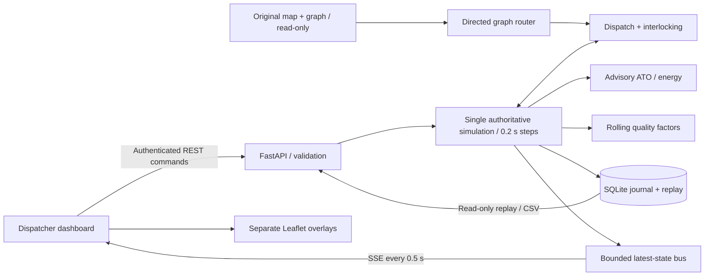

# Architecture and API

One Uvicorn worker owns live state. Commands and physics run on the same event loop. Wall-clock ticks accumulate simulation time; integration steps are ≤0.2 s. Work yields after 50 steps or approximately 35 ms; excess simulation time remains in a backlog reported as `lag_s`. Rendering never advances physics. Pause discards pending catch-up time. Incidents, preferences and configuration changes reconsider the plan synchronously.

`/map-live` reads `map.html`, substitutes local Leaflet library URLs and appends the overlay adapter. It does not rewrite geometry, labels, connections or styling. `/map.html` is the original file. The adapter toggles the existing menu, adds overlays and adjusts the viewport. SHA-256 checks verify all original map/graph/builder assets.

## API contract

`/docs` and `/openapi.json` are generated from actual Pydantic models. Units are in field names. Time values are seconds from the current simulation run's 00:00:00. `server_time` and journal `wall_time` are Unix seconds for diagnostics and retention.

| Method and route | Contract |
|---|---|
| `POST /api/login`, `/api/logout`; `GET /api/me` | Session cookie; dispatcher/administrator |
| `GET /api/state`, `/api/stream` | Full versioned state / 2 Hz SSE |
| `POST /api/control` | `start`, `pause`, `resume`, `reset`, `speed` |
| `POST /api/demo` | `passing`, `overtaking`, `priority`, `closure`, `empty` |
| `POST /api/trains` | Train configuration including independent importance |
| `PATCH /api/trains/{id}` | Importance / scheduled arrival; committed locks retained |
| `DELETE /api/trains/{id}` | Staged/terminal withdrawal only |
| `POST /api/incidents` | Type, affected asset, start, duration/manual clearance |
| `POST /api/incidents/batch` | Atomic validation; 1–10 incidents, one replan |
| `POST /api/incidents/{id}/clear` | Clearance and automatic replan |
| `POST /api/ingest` | Source, sequence, simulation timestamp, incident |
| `GET /api/network` | Station choices, real demo loop, hashes, assumptions |
| `GET /api/config`; `PUT /api/config` | Read settings; admin-only persistent updates |
| `GET /api/history?search=&kind=&run=&limit=` | Searchable journal, newest first |
| `GET /api/replay?start_s=&end_s=&run=` | Read-only snapshots, maximum 900 s |
| `GET /api/replay/runs` | Recent persisted run ranges |
| `GET /api/report.csv` | Current journal plus delay/energy/arrival summaries |
| `GET /health`; `GET /api/metrics` | Public liveness; authenticated operational metrics |

Incident station IDs are graph vertex IDs, not OSM node IDs. Signals at original edge entries are `SIG-{edge}-{direction}`; internal logical block signals append `-{canonical_block_index}`. Direction 0 means u→v, 1 means v→u. A signal failure currently closes its entire original edge in both directions; permissive degraded working is not simulated. A switch ID is an existing vertex with at least three incident edges. `via_siding` is an existing siding/yard edge used as a holding point, never a new station; it cannot be combined with station stops in the same demo journey.

Snapshots include `dispatcher` modelling metadata and, for each train, `occupied_blocks` and `reserved_blocks` with canonical IDs, edge offsets and clipped Leaflet geometry. Reserved blocks include the physical footprint; each block record has an `occupied` flag. Legacy `occupied_edges`/`reserved_edges` are aggregate map IDs, not exclusive resources: different trains can now share one original edge in different blocks. Unsplit resources use `e:<edge>`; subdivisions use `b:<edge>:<index>` with identical identities in either direction. Junctions retain `v:<vertex>` locks. `backend/blocks.py` constructs this overlay without modifying original assets.

`signal_block_m` (default 2,000) configures assumed maximum block length and cannot change while live track is held. `authority_lookahead_m` (default 5,000) configures the minimum requested reservation distance; dispatch increases it for maximum-speed braking and rounds to a logical block boundary. Existing grants cannot be revoked by changing this setting. See [dispatch rules](RULES.md) and [official source mapping](KAZAKHSTAN_RULES.md) for remaining station/direction limitations.

## Reliability

- States include `run_id`, monotonic `version`, and `plan_version`. The client discards obsolete versions and renders its newest buffered state on `requestAnimationFrame`, with a 100 ms fallback and synchronous initial-load updates. New runs reset the comparison scope. Action responses use the same ordering.
- Each SSE consumer has a two-snapshot queue. When full, it replaces the oldest snapshot. Signal and occupancy state is never interpolated or smoothed. The journal records transitions even if a slow renderer misses an intermediate state.
- Reconnect backs off from 0.5 to 15 s. Every connection receives a complete state. A stale indicator appears after 3 s, disconnected after 10 s. Connections/disconnections are logged.
- Mutation `Idempotency-Key` is scoped to identity, method and path, with request-body verification and a bounded 1,000-command cache. Ingestion rejects duplicate/decreasing sequence numbers, events older than 30 simulation seconds or over 5 s into the future. Future incident scheduling uses `start_s`.
- Validation rejects NaN/Infinity, unknown fields, invalid assets and incompatible lengths. Every incident in a batch validates before any is added. No external position sensors are accepted: mock position integration is noiseless, so smoothing would introduce error. Discrete safety state is presented unchanged.
- Replay disables live actions and the request wrapper rejects mutations during replay. Other users can continue operating live state. CSV export is read-only.

## Persistence and operation

SQLite events include unique ID, run, simulation/wall timestamps, type, actor, affected IDs, before/after and message. Snapshots include trains, signals, switches, incidents, authority version, alternatives, quality and recent decisions. Sampling is approximately once per simulation second. Pruning runs at most once per wall minute during snapshot writes: default 48 h, configurable 24–72 h. The UI selects the current run; older runs are available through the API.

Validated settings persist as JSON. Train definitions and changes persist in the journal. Restarts start a new paused live run rather than restoring moving trains. Credentials use environment variables with visible mock defaults. Sessions are in-memory, HttpOnly, SameSite=Strict; enable Secure when using HTTPS. Cross-origin browser mutations are rejected. Formula-like CSV fields are escaped.

This is a local single-process prototype. Distributed coordination, verified signaling, field telemetry, high availability and certified safety assurance are outside its scope.
