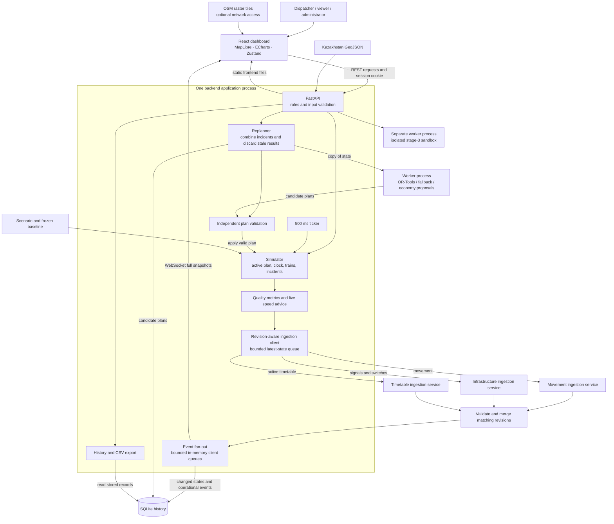

# RailFlow architecture

RailFlow is a local dispatcher advisory prototype. It displays the full Kazakhstan
rail dataset and simulates eight trains on the 302.5 km Astana–Kokshetau corridor.
The operating topology has six station anchors and five single-track sections.
Positions, signals, switches and incidents are synthetic; geometry comes from OSM.

## Components and deployment



The event fan-out is implemented inside the application. No Kafka/RabbitMQ server
is required. Simulation and connection state have one owner, so Uvicorn runs with
**one application worker**. The optimizer runs in a separate process to keep its
CPU work off the API event loop. Dispatch and economy calculations share that
worker; the isolated `/stage3.html` sandbox has its own worker.

Docker Compose runs `dispatch` plus three ingestion services. Only dispatch port
8000 is mapped to host loopback; ingestion ports remain on the internal network.
The `dispatch-data` volume stores SQLite. `scripts/run_local.py` starts the same
four services natively: dispatch on 8001 and ingestion on 8101–8103, all loopback.
It generates an ephemeral service token and supervises child processes. Local
history uses `data/dispatch.sqlite` unless overridden. See the [runbook](runbook.md).

The simulator produces mock observations. Each independently runnable ingestion
service accepts one typed, authenticated channel. All three responses must retain
the same epoch, state version, model time and canonical contents before publication
and snapshot archival. Failed or obsolete batches are rejected; a bounded queue
coalesces newer states. There is no silent fallback in remote mode. A missing feed
makes the browser stale and disables controls. Bare Uvicorn retains an explicit
`embedded` mode for lightweight development and unit tests, using the same schemas.

## Module responsibilities

| Responsibility | Source | Contract |
| --- | --- | --- |
| API, roles, lifecycle, publication | [main.py](../backend/app/main.py) | Validate commands, coordinate changes, publish full state |
| Ingestion services and delivery | [service.py](../backend/ingestion/service.py), [contracts.py](../backend/ingestion/contracts.py), [client.py](../backend/ingestion/client.py) | Normalize movement/infrastructure/timetable independently; atomically publish matching revisions |
| Live model and reset | [simulator.py](../backend/app/simulator.py), [timing.py](../backend/app/timing.py) | Own model time, committed movement and epoch |
| Infrastructure and train coordinates | [domain.py](../backend/app/domain.py), [railway_map.py](../backend/app/railway_map.py) | Project model distance onto corridor geometry |
| Scheduling | [planning.py](../backend/app/planning.py), [dispatch.py](../backend/app/dispatch.py) | Feasible candidate plans, priorities and pass/wait explanations |
| Replanning coordination | [replanning.py](../backend/app/replanning.py) | Coalesce incidents, reject outdated work, record comparisons |
| Independent safety constraints | [validation.py](../backend/app/validation.py) | Sections, tail release, station capacity, switches, dwell, physics and incidents |
| Speed and energy | [advisory.py](../backend/app/advisory.py), [speed_advice.py](../backend/app/speed_advice.py) | Shared movement profile for simulation and recommendations |
| Movement quality | [metrics.py](../backend/app/metrics.py), [capacity.py](../backend/app/capacity.py), [quality_config.py](../backend/app/quality_config.py) | Five components, runtime formula/weights/thresholds and formula signature |
| Persistence and reporting | [storage.py](../backend/app/storage.py), [reports.py](../backend/app/reports.py) | Retained snapshots/events/plans; read-only replay and CSV |
| Browser state and reconnection | [realtime.ts](../frontend/src/realtime.ts), [store.ts](../frontend/src/store.ts) | Reject stale replies, reconnect on gaps, apply authoritative snapshots |
| Offline data preparation | [railway_parser.py](../parser/railway_parser.py), [build_corridor.py](../scripts/build_corridor.py) | Import line geometry and derive demo infrastructure |

## Incident to applied plan

```mermaid
sequenceDiagram
    participant UI as Dashboard
    participant API as FastAPI
    participant Model as Simulator
    participant Replan as Replanner
    participant Worker as Solver worker
    participant Check as Validator
    participant Store as SQLite
    UI->>API: Create delay, closure or signal incident
    API->>Model: Update incident, constraint version and departure hold
    API-->>UI: Publish incident and full state
    API->>Replan: Queue latest conditions
    Replan->>Worker: Send copied state after debounce
    Note over Model,Worker: Started movement continues; above 60x the model clock waits
    Worker-->>Replan: Candidate schedules
    Replan->>Check: Validate against current model state
    alt reset or newer conditions
        Replan->>Replan: Discard stale result; process latest request
    else valid candidates
        Replan->>Store: Save candidates
        Replan-->>UI: Publish recommended comparison
        alt automatic application
            Replan->>Check: Revalidate immediately before installation
        else manual review
            UI->>API: Apply selected candidate
            API->>Replan: Request selected candidate installation
            Replan->>Check: Revalidate selected candidate
        end
        Check-->>Replan: Current validation result
        alt still valid at application
            Replan->>Model: Install plan and release departure hold
            Replan->>API: Publish application comparison
            API->>Store: Save comparison and changed snapshot
            API-->>UI: Publish applied plan and full state
        else candidate became invalid
            API-->>UI: Reject application; request a new calculation
        end
    else no feasible current plan
        Replan-->>UI: Publish failure and retry guidance
        Note over Model: Existing plan retained; new departures remain held if incident requires it
    end
```

The diagram groups application calls by responsibility. No worker may directly
replace live state. Every application path, including economy proposals, passes
the same current-state validator before the replanner installs it.

The coordinator combines incident bursts with a 300 ms debounce. It retries
results invalidated only by advancing model time at most three times. A reset or
new incident invalidates in-flight results. Already-started movements are immutable.
If a valid replacement cannot be found, the failure and hold remain visible.

## State, units and clocks

| Identity or value | Meaning |
| --- | --- |
| `stream_id`, `seq` | Server-start identity and ordered event sequence; detect restart, duplicates and gaps |
| `epoch` | Simulation-run identity, changed by reset or backend restart |
| `state_version` | Monotonic version of state within a run; can jump when accelerated time advances |
| `constraint_version` | Incident/scoring-setting changes that invalidate candidate plans |
| `active_plan_id` | Timetable currently followed by the simulator |
| `quality_signature` | Formula, weights, normalization and thresholds used for a score |
| `observed_at` | UTC wall-clock sample timestamp |
| `sim_time_s` | Model seconds from the scenario start; the UI displays zero as 08:00 |
| Distances/speeds | Metres and m/s internally; UI converts to km and km/h |
| Coordinates | WGS84 `[longitude, latitude]` |
| Energy | kWh from the synthetic traction model |

The ticker targets 2 Hz using monotonic deadlines. The multiplier means model
seconds per real second; 30x normally advances 15 model seconds each tick. Missed
deadlines are skipped without an unobserved catch-up jump. Paused/completed runs
still publish snapshots, but unchanged states do not create duplicate archive rows.
Transport cadence is a different measurement from browser event-to-paint latency.

## History and forecast meaning

SQLite records contain identity, wall-clock creation time, run, kind, model time
and small JSON query metadata. Payloads of at least 1 KB are losslessly compressed
in a related binary table; legacy JSON rows remain readable without rewriting.
Retention defaults to 48 real hours and is clamped to 24–72. Cleanup runs during
writes and the paused heartbeat, normally once a minute; backlogs are drained in
bounded batches. Archive queries also filter expired records. Deleted pages are
reusable; file shrinkage is not guaranteed. The run selector exposes 20 recent runs.

Replaying 5/10/15 model minutes reads saved frames. It never mutates live state.
CSV exports use a frozen record-ID boundary, so subsequent updates cannot silently
change a selected report. Reset/restart creates a new live run and retains history.
It does **not** resume the last live scenario from SQLite.

Current metrics describe movement already observed. Candidate/application
comparisons evaluate two whole-scenario forecasts using the same conditions.
Saved comparisons retain their original formula even after settings change.
An invalid old plan can have less theoretical delay than its feasible replacement;
that difference is not presented as a measured improvement.

## Roles and deployment limits

`DEMO_MODE=true` grants the local demo admin access. With demo mode disabled,
environment-provided passwords establish HttpOnly, SameSite sessions for viewer,
dispatcher and admin roles. Viewer access covers reads/export and the isolated
stage-3 sandbox; dispatchers operate the live model; admins additionally change
scoring and optimization weights. API checks enforce roles independently of UI
controls. Sessions are in memory, expire after eight hours and end on restart.

The deployment has three independent ingestion services and one application that
owns simulation, sessions and scheduling coordination. Mock observations enter
the service contracts; real railway feeds would need source adapters. The brief
allows mock data and an emulated event bus. Multiple API instances
would require shared live state, durable messaging and a shared session system;
adding `--workers 2` alone would create independent simulations.

This is advisory demonstration software with synthetic signalling/capacity and a
level-track traction model. It does not control real railway safety equipment.

See [API contracts](api.md), [realtime recovery](realtime.md),
[dispatch constraints](autodispatcher.md), and [replanning](replanning.md).
