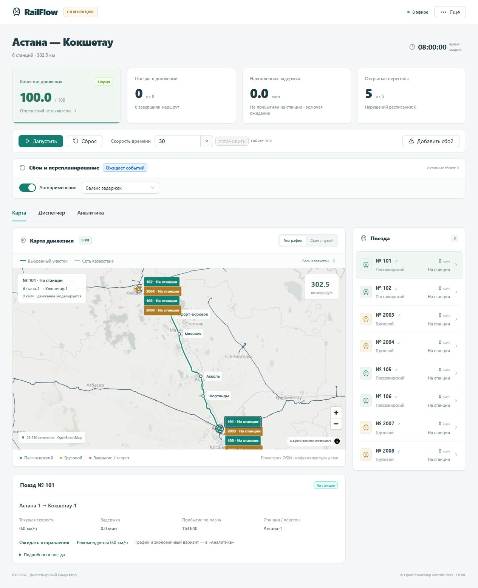

# Local final verification — 2026-10-02

> **Historical report, before the latest fixes.** See
> [current verification](compliance-verification.md): three independent ingestion
> services, compressed history, 24/48/72-hour accelerated retention tests, and
> browser-reported visible paints below 77 ms. Its results supersede the
> corresponding architecture/storage/render-proxy limitations below.

The eight feature stages and the final **local prototype verification** are
complete. No further feature stage is planned. Presentation work is deferred at
the user's request. This does not claim full compliance with every deployment
detail of the case deck; the qualifications below still apply.

## Fix found in the browser

After spending time on the login screen or losing the connection, the dashboard
could remain in “Нет свежих данных” even after receiving fresh WebSocket frames.
The one-second freshness timer was recreated every half-second update, preventing
it from clearing an already-stale flag. `watchFreshness` now checks immediately
on each new timestamp and retains the timer for detecting a later outage.

A new regression test reproduces stale state followed by 2 Hz updates, then a
second outage and cleanup. Browser verification confirmed a delayed dispatcher
login enables controls, and a stopped/restarted backend reconnects automatically
without reloading the page. Controls remain disabled while disconnected.

## Results

Machine: Windows 11 Pro 10.0.26200, Intel Core i5-10300H, 8 logical processors,
approximately 16 GiB RAM. Python 3.12.14, Node 24.19.0, pnpm 11.25.0. Browser:
Codex In-app Browser reporting Chrome 154.0.0.0, 1280 × 720 for timing samples.
Tests used separate SQLite files and loopback servers, leaving the main
`http://127.0.0.1:8001/` simulation intact. See [machine-readable results](acceptance-results.json).

| Check | Result |
| --- | --- |
| Python tests | **157 passed** |
| Frontend tests | **21 passed**, including the new freshness regression |
| TypeScript and production build | Passed; existing large-bundle warning remains |
| Replanning: closure, signal failure, train delay, five/ten incident bursts | **20 cases passed**: three repetitions before the fix, one after |
| Request → validated applied plan received over WebSocket | Initial 15 cases: median **0.8211 s**, max **1.8604 s**; final five: median **0.5385 s**, max **1.3132 s**; all ≤5 s |
| Resulting schedule conflicts | **0** in every performance case |
| Incoming WebSocket feed | Mean **499.64 ms**, max **529.04 ms** in the dedicated timing check; max **627.60 ms** across repeated incident cases |
| Model clock and pause | 7x advanced exactly **42 model seconds** across twelve half-second intervals; pause stayed fixed |
| Closure changes quality | Browser: **100 → 96**, four of five sections available; reset restored 100 |
| Authenticated roles | Viewer cannot operate or edit settings; dispatcher can operate but cannot edit admin settings; administrator saved a threshold of 95; logout returned to login |
| Alternative schedule | Passenger-priority candidate previewed and applied through the UI; live API check also selected a nonrecommended candidate |
| Archive and CSV | Browser replay advanced from frame 1 to frame 7 of a 15-minute window, controls disabled; downloaded CSV parsed successfully with **1,160 rows** |
| Restart recovery | Stopped isolated server, observed disconnected/disabled state, restarted it; browser recovered without reload |
| Layout | Desktop and 390 px narrow-window checks; no horizontal page overflow in the measured views; keyboard opened dispatch tab |

Separate sequential live checks passed for automatic/manual replanning, early
incident resolution, per-candidate comparisons, runtime quality settings, speed
advice and report/history stability. The report smoke checked **764 CSV rows**,
conflicts **2 → 0**, and identical archived export after reset. Economy advice
preserved terminal ETA with **52.27 kWh forecast saving**. Automated tests cover
reset during in-flight calculation and rejection of invalid/stale results.

### Browser rendering measurements

The opt-in `?performance=1` probe starts timing at the WebSocket message handler,
includes JSON parsing, measures React's committed dashboard/map-marker update,
then waits for two `requestAnimationFrame` callbacks. This measures a **paint
opportunity**, a practical browser-rendering proxy, not physical screen latency.
It does not time external tile downloads or claim every intermediate/coalesced
event was painted. Map DOM updates can occur below the viewport; screenshots and
interactive map checks supplement the timing evidence.

Final-build samples with a visible document and a running simulation:

| Surface / condition | Samples | Median | p95 | Maximum |
| --- | ---: | ---: | ---: | ---: |
| Dashboard, no incidents | 26 | 15.9 ms | 31.0 ms | 31.9 ms |
| Dashboard, incidents | 68 | 22.5 ms | 32.9 ms | **45.3 ms** |
| Map markers, no incidents | 26 | 15.7 ms | 30.9 ms | 31.6 ms |
| Map markers, incidents | 68 | 22.3 ms | 32.7 ms | **45.1 ms** |

Incident samples include 22 per surface with at least five incidents. No sampled
update exceeded 500 ms. The longer initial sample also stayed below the limit:
maximum **421.1 ms** for dashboard and **434.0 ms** for markers. Differences between
runs are not a claimed speedup from the freshness fix. Sampled map navigation,
train selection, quality drawer and menu clicks remained responsive; observed
click-handler-to-paint-opportunity times ranged **20.2–86.6 ms**. This is a small
interaction sample, not an INP benchmark or full accessibility audit.

## Repeat these checks

Use the [runbook's isolated server](runbook.md#automated-checks). Open its dashboard
with `http://127.0.0.1:8012/?performance=1`, wait for the country network to load,
then run in another terminal:

```powershell
.\.venv\Scripts\python.exe scripts/smoke_performance.py http://127.0.0.1:8012 --repetitions 3 --output .logs/performance.json
```

This script resets its target before each case and afterwards; do not point it
at a scenario you want to preserve or run other mutating smoke scripts alongside
it. It enforces ≤5 seconds from first incident request through applied-plan
receipt, includes debounce and solver retries, checks zero conflicts, and checks
the feed never falls below 1 Hz in sampled intervals.

Browser diagnostics print bounded `railflow.performance` JSON messages to the
local console (up to 2,000 per page load). Group snapshots by `surface`, `running`
and `incidents`, restrict to `visibility: "visible"`, and report sample count,
median, p95 and maximum of `paint_opportunity_ms`. No telemetry is uploaded and
the probe is disabled on the normal URL. Reload to start a fresh sample. The
separate realtime smoke now also explicitly fails if replanning exceeds 5 s.

## Remaining qualifications

- Local dependencies were already installed. A clean-machine installation and
  Docker startup were not repeated; Docker is unavailable here.
- No 24–72-hour soak was performed. The isolated test database reached **19.35 MB**
  with 493 snapshots, 296 events and 47 plans. Mean snapshot payload was about
  **34.7 KB**. Sustained 2 Hz recording projects roughly **250 MB/hour** of snapshot
  JSON alone, or **12 GB/48 hours**, before indexes/events. This is an extrapolation;
  paused/completed simulations do not continually write unchanged snapshots.
  SQLite reuses deleted pages but does not automatically shrink its file. Size
  storage for the chosen retention before prolonged use.
- The architecture is a modular API with worker processes and an event-bus
  imitation. Separate ingestion microservices and a real railway feed remain
  outside this prototype; infrastructure and capacity are simulated.
- Browser measurements establish the sampled local render proxy. Physical
  display timing, slower hardware, multi-client capacity and cold internet tile
  loading are not certified by these numbers.
- Source publication, a submission presentation and a recorded/live defense are
  separate delivery work. No commit or push was performed in this stage.


